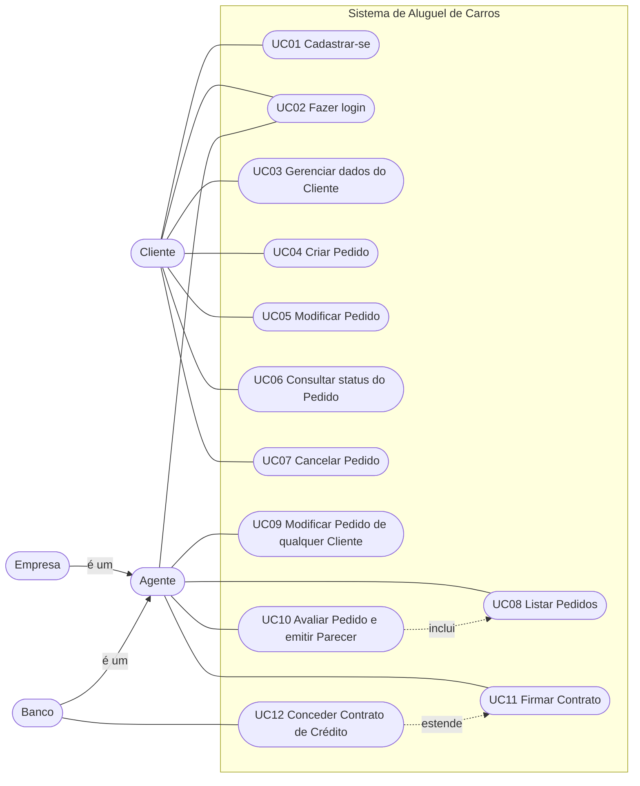

# Diagrama de Casos de Uso

Empresa e Banco são especializações de Agente; o Banco acrescenta a concessão de Contrato de Crédito. Todos os casos de uso, exceto UC01 e UC02, exigem login.

```mermaid
flowchart LR
    Cliente([Cliente])
    Agente([Agente])
    Empresa([Empresa])
    Banco([Banco])
    Empresa -- é um --> Agente
    Banco -- é um --> Agente

    subgraph Sistema[Sistema de Aluguel de Carros]
        UC01([UC01 Cadastrar-se])
        UC02([UC02 Fazer login])
        UC03([UC03 Gerenciar dados do Cliente])
        UC04([UC04 Criar Pedido])
        UC05([UC05 Modificar Pedido])
        UC06([UC06 Consultar status do Pedido])
        UC07([UC07 Cancelar Pedido])
        UC08([UC08 Listar Pedidos])
        UC09([UC09 Modificar Pedido de qualquer Cliente])
        UC10([UC10 Avaliar Pedido e emitir Parecer])
        UC11([UC11 Firmar Contrato])
        UC12([UC12 Conceder Contrato de Crédito])
    end

    Cliente --- UC01
    Cliente --- UC02
    Cliente --- UC03
    Cliente --- UC04
    Cliente --- UC05
    Cliente --- UC06
    Cliente --- UC07
    Agente --- UC02
    Agente --- UC08
    Agente --- UC09
    Agente --- UC10
    Agente --- UC11
    Banco --- UC12
    UC10 -. inclui .-> UC08
    UC12 -. estende .-> UC11
```
